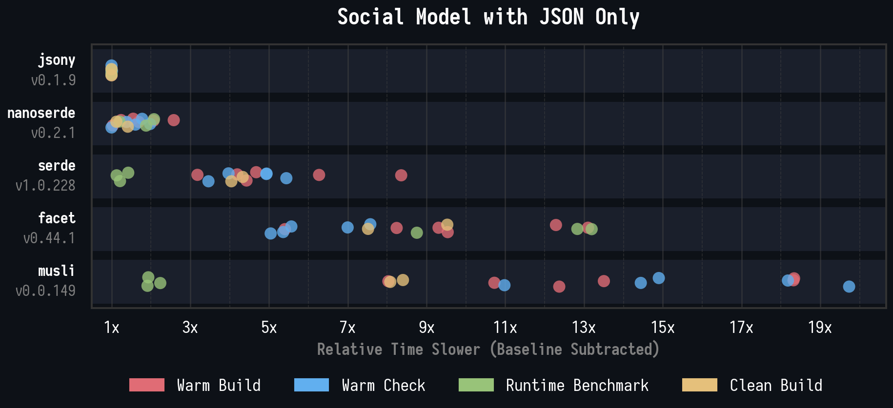
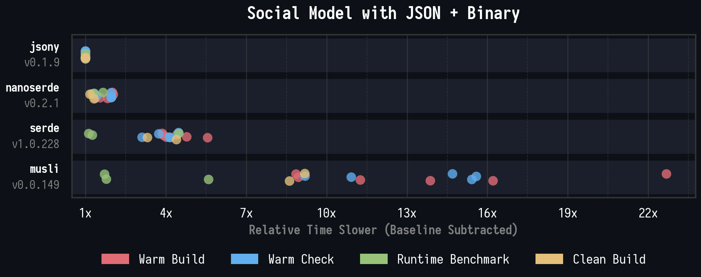
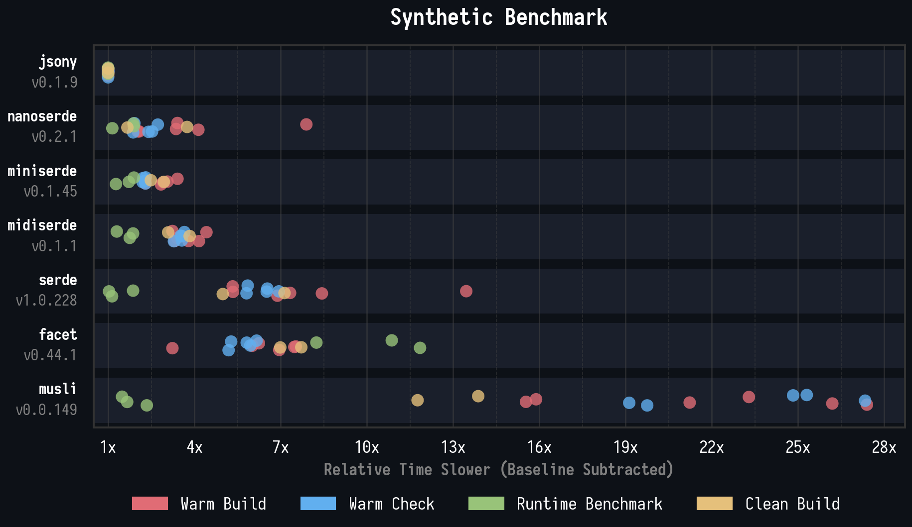

# Incremental Build and Check Cost of Rust Serialization Library Benchmarks

This benchmark suite measures the compile time and runtime cost of Rust serialization libraries across warm builds, warm checks, clean builds, and runtime performance.

See [GUIDE.md](GUIDE.md) if you want to run them yourself.

## Social Model with JSON Only

Uses a realistic social media data model (users, posts, comments, reactions) to test JSON-only serialization & deserialization.

Data model: [social-only-json_model.rs](report/social-only-json_model.rs)



### See [detailed results](report/BENCH-social-only-json.md) for per-scenario breakdowns.

## Social Model with JSON + Binary

Same social media data model but testing both JSON and binary serialization & deserialization.

Data model: [social-with-binary_model.rs](report/social-with-binary_model.rs)



### See [detailed results](report/BENCH-social-with-binary.md) for per-scenario breakdowns.

## Synthetic Benchmark

Generates 75 random structs with random field types to test raw derive macro throughput and compilation overhead.

Data model: [synthetic_model.rs](report/synthetic_model.rs)



### See [detailed results](report/BENCH-synthetic.md) for per-scenario breakdowns.

## System Information

```
rustc:   rustc 1.94.0 (4a4ef493e 2026-03-02) (LLVM 21.1.8)
os:      Arch Linux (kernel 6.18.13-arch1-1)
cpu:     AMD Ryzen 9 5950X 16-Core Processor (32 threads)
memory:  63 GB
caches:  L1d: 512 KiB (16 instances), L1i: 512 KiB (16 instances), L2: 8 MiB (16 instances), L3: 64 MiB (2 instances)
```

## Methodology

This benchmark suite generates Rust source code for various data models, writes it into a temporary crate, then benchmarks compile time and runtime across multiple serialization libraries.

All measurements are taken with Linux `perf stat`, capturing wall-clock duration, CPU cycles, instructions, and task-clock.

### Libraries

| Library                                            | Formats                   | Tags                         |
| -------------------------------------------------- | ------------------------- | ---------------------------- |
| [jsony](https://github.com/exrok/jsony)            | JSON & Binary             | Very Experimental            |
| [serde](https://github.com/serde-rs/serde)         | Many Formats              | Stable, Community Standard   |
| [musli](https://github.com/udoprog/musli)          | JSON & Binary             | Experimental                 |
| [facet](https://github.com/facet-rs/facet)         | Many Formats              | Experimental                 |
| [nanoserde](https://github.com/not-fl3/nanoserde)  | JSON, Binary, TOML*, RON* | Limited Features             |
| [miniserde](https://github.com/dtolnay/miniserde)  | JSON                      | Very Limited Features        |
| [midiserde](https://codeberg.org/noclue/midiserde) | JSON                      | Limited Features, AI Written |

I was on the fence about what I should say but I felt I needed to add something, the various libraries have
diverse feature sets, format support and production readiness. These determinations where made in March of 2026.

We regard to "Limited Features", I'm primarily refering to what is support in derive macros and how flexible the
libary can represent a data model. I could not find comprehsive documentation on facet's derive macro, (if a facet
maintainer is reading this I recommand putting it directly on the [derive macro like jsony](https://docs.rs/jsony/latest/jsony/derive.Jsony.html)). Due
to facet's reflection model there are a number limitations, but I didn't now how concisely embody them in a tag.

Disclaimer: I authored jsony, and used some of these benchmarks (and others) to guide its development. I do think
they are representive though but I do want to highlight the highly experimental nature of jsony. There are features
still missing from stable rust needed to make jsony both fast and robustly sound. If your using these benchmarks to choose
which library to use, you should keep the table above in mind. Your mental model should be something:

> Jsony is featureful, fast at compile-time and runtime but it's very experimental so I won't use it in production,
> maybe I'll try it out for this little through away script.

Or

> I need to support for many formats, I'm not concerned with compile/check time, I'll just stick with serde it's stable, the community standard,
> and has great runtime performance.

Or

> I have very minimal serialization needs which nanoserde supports perfectly, it's relatively stable and makes minimal use of unsafe, all well
> doing quite well on these benchmarks.

### Benchmark Scenarios

**Warm Build / Warm Check**: All dependencies are pre-built and cached. The benchmark extracts the raw `rustc` command from `cargo build -vv` output, then invokes `rustc` directly via `perf stat`. This isolates the cost of compiling just the user crate (struct definitions + serialization code) without any cargo overhead. "Warm Build" produces a binary; "Warm Check" only type-checks.

**Clean Build**: The target directory is wiped with `cargo clean` before each sample. This measures the full `cargo build` pipeline including dependency resolution, so results include cargo overhead and any dependency rebuilds.

**Runtime**: Uses example program we where doing the compilation times benchmarks on, to deserialize and serialization the respective data model in a micro benchmark fashion.
These Runtime benchmarks are very narrow and well I think they give you an acurate highlevel pictures for specific data the details the exact performance ratios are likely
to change. I decide to keep them as I do think they helpful for framing these accurately, for instance serde has good runtime performance but slows down all your tooling.

### Baseline

Each benchmark class runs a baseline measurement where applicable, the same generated structs with no serialization library. The baseline captures the inherent cost of compiling the struct definitions and boilerplate alone. All reported results are normalized by subtracting the baseline, so the numbers reflect only the overhead added by each serialization library.

Runtime benchmarks, don't have a baseline and are instead reported directly.

### Interpreting Aggregated Graphs

The aggregate graph is jittered per libary strip plot showing how many times slow that libary was in each
benchmark compared to the fast libary. Since `jsony` is currently the fastest libary for almost all benchmarks,
you could already as how many times slower was it in that specific benchmark then `jsony`.

Each dot represents mean runtime of samples for a specifc benchmark. Each dot represents a unique configuration,
The colors represent the different classes of benchmarks. The spread of dots from same classes does not represent
the variance of single benchmark, they are just different benchmarks examples:

Runtime benchmarks do both Release, Release+LTO and Debug builds.

Check benchmarks has variant with and wihout incremental compliation enabled as well as different types
of edits occouring the code-base between innovcations.

I've tried to keep the relative order of libraries, consistent throughout with the order being determined by
the overall aggregated benchmark scores.

I encourage you to look into the detailed benchmarks which provide benchmark results for each variant in detail
along with CPU instructions, Cycle count, etc and the runtime benchmarks include the final binary size.
