# Social Model with JSON Only

Uses a realistic social media data model (users, posts, comments, reactions) to test JSON-only serialization & deserialization.

Data model: [social-only-json_model.rs](social-only-json_model.rs)

## Benchmark Results

### Libraries
- jsony v0.1.9
- nanoserde v0.2.1
- serde v1.0.228
- facet v0.44.1
- musli v0.0.149

### Incremental Modes
- `Disabled`: `-C incremental` wasn't specified in the rustc invocation
- `Unchanged`: Rebuild when no file content changed (`touch src/main.rs`)
- `Postfix`: New content added to end of the module
- `Prefix`: New content added to start of the module

### Metrics
Measured with Linux `perf stat`:
- **Duration**: Wall-clock time in milliseconds
- **Bcycles**: Billion CPU cycles
- **Binst**: Billion CPU instructions
- **task-clock**: CPU clock time across all cores

## Table of Contents

- [Warm Check](#warm-check): All dependencies cached and prebuilt, only the bin crate is checked. Rustc is invoked directly using the same parameters as cargo.
- [Warm Build](#warm-build): All dependencies cached and prebuilt, only the bin crate is rebuilt. Rustc is invoked directly using the same parameters as cargo.
- [Clean Build](#clean-build): Dependencies in global cache but target is empty after `cargo clean`. Measures full `cargo build` time.
- [Runtime Benchmark](#runtime-benchmark): Run the built executable with JSON input and high iteration count.
- [Binary Size](#binary-size): Stripped binary size of the built executable.

## Warm Check

### WarmCheck { incremental: Disabled }


```rust
      jsony:    33.00 ms    0.122687 Bcycles   0.160829 Binst    28.76 task-clock
  nanoserde:    58.66 ms    0.255433 Bcycles   0.463455 Binst    54.86 task-clock
      serde:   162.96 ms    0.713239 Bcycles   1.043176 Binst   157.95 task-clock
      facet:   183.72 ms    0.824449 Bcycles   1.227812 Binst   179.92 task-clock
      musli:   599.87 ms    2.759174 Bcycles   4.282064 Binst   597.19 task-clock
```

Baseline reference stats: `   39.28 ms    0.145212 Bcycles   0.207098 Binst    38.15 task-clock`
### WarmCheck { incremental: Unchanged }


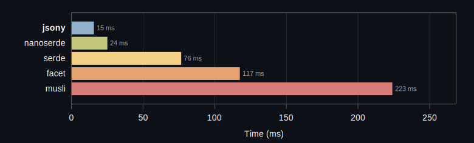


```rust
      jsony:    15.49 ms    0.066969 Bcycles   0.104084 Binst    15.31 task-clock
  nanoserde:    24.90 ms    0.105627 Bcycles   0.188312 Binst    24.60 task-clock
      serde:    76.42 ms    0.327733 Bcycles   0.526930 Binst    72.91 task-clock
      facet:   117.32 ms    0.497591 Bcycles   0.809227 Binst   113.23 task-clock
      musli:   223.74 ms    1.008653 Bcycles   1.686536 Binst   219.39 task-clock
```

Baseline reference stats: `   26.55 ms    0.088587 Bcycles   0.144318 Binst    25.60 task-clock`
### WarmCheck { incremental: Postfix }


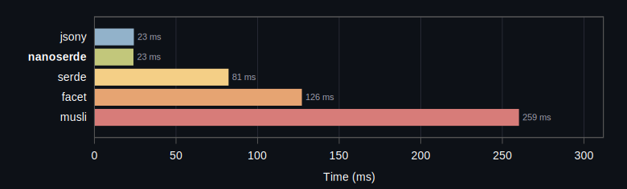


```rust
      jsony:    23.91 ms    0.088778 Bcycles   0.117183 Binst    20.75 task-clock
  nanoserde:    23.67 ms    0.106549 Bcycles   0.208179 Binst    23.49 task-clock
      serde:    81.96 ms    0.353066 Bcycles   0.574376 Binst    77.89 task-clock
      facet:   126.88 ms    0.546736 Bcycles   0.887192 Binst   122.59 task-clock
      musli:   259.93 ms    1.158509 Bcycles   1.889102 Binst   257.13 task-clock
```

Baseline reference stats: `   29.06 ms    0.096288 Bcycles   0.154748 Binst    28.01 task-clock`
### WarmCheck { incremental: Prefix }


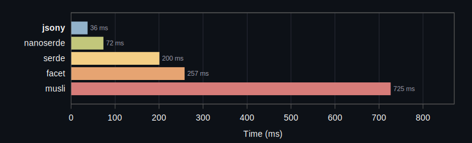


```rust
      jsony:    36.78 ms    0.163368 Bcycles   0.225026 Binst    36.45 task-clock
  nanoserde:    72.84 ms    0.313611 Bcycles   0.553572 Binst    70.71 task-clock
      serde:   200.10 ms    0.888905 Bcycles   1.282800 Binst   195.70 task-clock
      facet:   257.35 ms    1.161814 Bcycles   1.671880 Binst   253.17 task-clock
      musli:   725.82 ms    3.305590 Bcycles   5.050481 Binst   721.01 task-clock
```

Baseline reference stats: `   43.53 ms    0.162216 Bcycles   0.234171 Binst    42.30 task-clock`
### WarmCheck { incremental: TypeTransform }


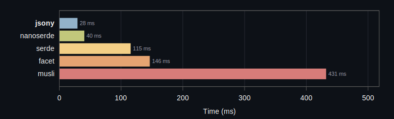


```rust
      jsony:    28.97 ms    0.123463 Bcycles   0.158431 Binst    28.82 task-clock
  nanoserde:    40.04 ms    0.185156 Bcycles   0.351096 Binst    39.83 task-clock
      serde:   115.07 ms    0.505782 Bcycles   0.788921 Binst   112.55 task-clock
      facet:   146.08 ms    0.645172 Bcycles   1.020963 Binst   143.24 task-clock
      musli:   431.66 ms    1.974445 Bcycles   3.257035 Binst   428.38 task-clock
```

Baseline reference stats: `   40.58 ms    0.146394 Bcycles   0.215077 Binst    39.42 task-clock`
## Warm Build

### WarmBuild { incremental: Disabled, profile: Release }


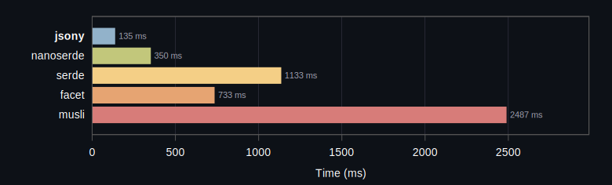


```rust
      jsony:   135.65 ms    1.585312 Bcycles   2.199404 Binst   354.31 task-clock
  nanoserde:   350.02 ms    3.226308 Bcycles   5.513439 Binst   705.66 task-clock
      serde:  1133.61 ms    8.333384 Bcycles  12.522986 Binst  1806.66 task-clock
      facet:   733.12 ms   10.795678 Bcycles  15.898778 Binst  2472.52 task-clock
      musli:  2487.04 ms   14.086166 Bcycles  22.963690 Binst  3043.06 task-clock
```

Baseline reference stats: `  185.16 ms    1.026497 Bcycles   1.506669 Binst   245.30 task-clock`
### WarmBuild { incremental: Disabled, profile: Debug }


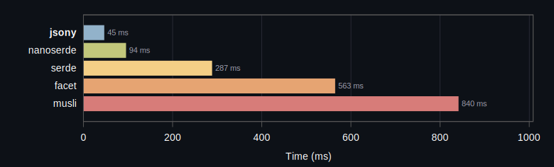


```rust
      jsony:    45.89 ms    0.271747 Bcycles   0.413907 Binst    62.96 task-clock
  nanoserde:    94.76 ms    0.684194 Bcycles   1.285971 Binst   154.65 task-clock
      serde:   287.77 ms    1.954294 Bcycles   3.113543 Binst   443.60 task-clock
      facet:   563.83 ms    2.827614 Bcycles   4.699294 Binst   679.48 task-clock
      musli:   840.60 ms    4.998358 Bcycles   7.956439 Binst  1102.23 task-clock
```

Baseline reference stats: `  143.53 ms    0.714735 Bcycles   1.124811 Binst   182.22 task-clock`
### WarmBuild { incremental: Unchanged, profile: Debug }


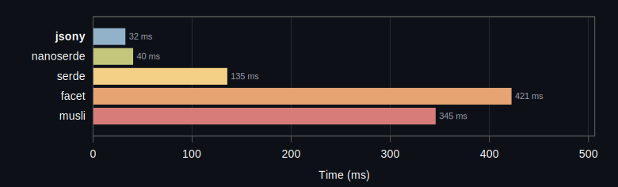


```rust
      jsony:    32.21 ms    0.138230 Bcycles   0.233885 Binst    34.50 task-clock
  nanoserde:    40.04 ms    0.217543 Bcycles   0.437399 Binst    49.07 task-clock
      serde:   135.06 ms    0.716716 Bcycles   1.216881 Binst   167.48 task-clock
      facet:   421.95 ms    1.790514 Bcycles   3.191476 Binst   461.41 task-clock
      musli:   345.39 ms    1.747245 Bcycles   2.785414 Binst   414.77 task-clock
```

Baseline reference stats: `  104.28 ms    0.426681 Bcycles   0.706264 Binst   128.74 task-clock`
### WarmBuild { incremental: Postfix, profile: Debug }


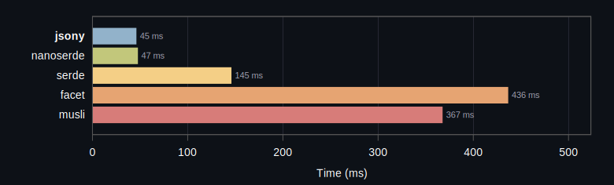


```rust
      jsony:    45.74 ms    0.174957 Bcycles   0.247262 Binst    43.38 task-clock
  nanoserde:    47.31 ms    0.239106 Bcycles   0.457140 Binst    57.49 task-clock
      serde:   145.54 ms    0.764079 Bcycles   1.265214 Binst   180.11 task-clock
      facet:   436.24 ms    1.841574 Bcycles   3.271502 Binst   472.66 task-clock
      musli:   367.33 ms    1.854422 Bcycles   2.989719 Binst   438.03 task-clock
```

Baseline reference stats: `  103.31 ms    0.424505 Bcycles   0.716654 Binst   127.86 task-clock`
### WarmBuild { incremental: Prefix, profile: Debug }


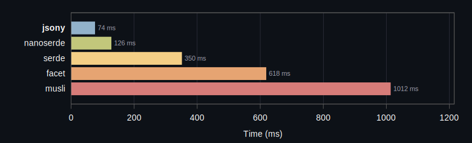


```rust
      jsony:    75.00 ms    0.319942 Bcycles   0.416868 Binst    78.17 task-clock
  nanoserde:   126.83 ms    0.639958 Bcycles   1.228828 Binst   140.51 task-clock
      serde:   350.54 ms    1.979378 Bcycles   3.102927 Binst   447.99 task-clock
      facet:   618.08 ms    2.827197 Bcycles   4.655076 Binst   688.50 task-clock
      musli:  1012.75 ms    5.108274 Bcycles   7.917359 Binst  1148.55 task-clock
```

Baseline reference stats: `  122.72 ms    0.509767 Bcycles   0.806218 Binst   147.88 task-clock`
### WarmBuild { incremental: TypeTransform, profile: Debug }


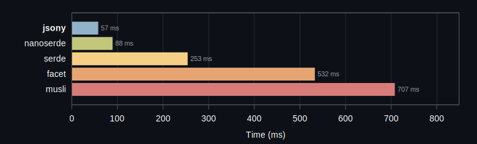


```rust
      jsony:    57.18 ms    0.299394 Bcycles   0.454097 Binst    71.05 task-clock
  nanoserde:    88.66 ms    0.615981 Bcycles   1.169138 Binst   145.24 task-clock
      serde:   253.22 ms    1.824850 Bcycles   2.939520 Binst   421.62 task-clock
      facet:   532.06 ms    2.743266 Bcycles   4.699183 Binst   683.55 task-clock
      musli:   707.33 ms    4.301298 Bcycles   6.682593 Binst   991.91 task-clock
```

Baseline reference stats: `  147.70 ms    0.789591 Bcycles   1.205647 Binst   214.90 task-clock`
## Clean Build

### CleanBuild { profile: Debug }


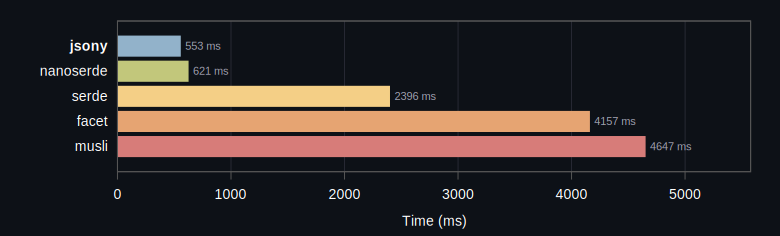


```rust
      jsony:   553.25 ms    4.670501 Bcycles   6.743671 Binst  1134.90 task-clock
  nanoserde:   621.94 ms    3.801556 Bcycles   6.094461 Binst   891.68 task-clock
      serde:  2396.26 ms   26.141347 Bcycles  38.256518 Binst  6233.89 task-clock
      facet:  4157.49 ms   62.884280 Bcycles  87.640717 Binst 15012.63 task-clock
      musli:  4647.95 ms   27.167487 Bcycles  41.501443 Binst  6197.75 task-clock
```

Baseline reference stats: `  222.26 ms    1.146289 Bcycles   1.811851 Binst   317.28 task-clock`
### CleanBuild { profile: Release }


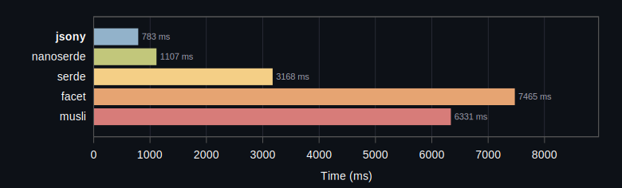


```rust
      jsony:   783.62 ms    8.619533 Bcycles  11.910626 Binst  2012.81 task-clock
  nanoserde:  1107.41 ms    9.995878 Bcycles  15.794222 Binst  2253.35 task-clock
      serde:  3168.42 ms   37.193781 Bcycles  53.459352 Binst  8618.51 task-clock
      facet:  7465.92 ms  148.881913 Bcycles 204.051210 Binst 34862.35 task-clock
      musli:  6331.13 ms   36.681150 Bcycles  57.028706 Binst  8178.34 task-clock
```

Baseline reference stats: `  232.35 ms    1.162990 Bcycles   1.804336 Binst   288.89 task-clock`
## Runtime Benchmark

### RuntimeBenchmark { profile: ReleaseLto }


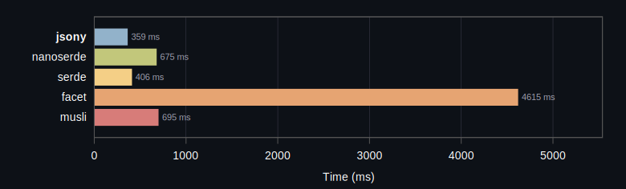


```rust
      jsony:   359.76 ms    1.554699 Bcycles   6.184807 Binst   346.57 task-clock       68 kb (stripped)
  nanoserde:   675.68 ms    3.085949 Bcycles  11.855207 Binst   661.87 task-clock      160 kb (stripped)
      serde:   406.64 ms    1.755468 Bcycles   6.241446 Binst   386.73 task-clock      188 kb (stripped)
      facet:  4615.86 ms   21.862534 Bcycles  48.140699 Binst  4597.54 task-clock     1660 kb (stripped)
      musli:   695.94 ms    3.152599 Bcycles  10.368396 Binst   678.48 task-clock      128 kb (stripped)
```

Baseline reference stats: `    0.00 ms    0.000000 Bcycles   0.000000 Binst     0.00 task-clock      341 kb (stripped)`
### RuntimeBenchmark { profile: Release }


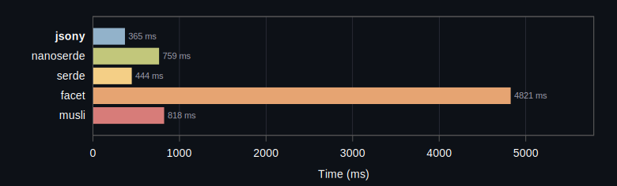


```rust
      jsony:   365.44 ms    1.644485 Bcycles   6.547766 Binst   364.99 task-clock       76 kb (stripped)
  nanoserde:   759.71 ms    3.490788 Bcycles  12.747661 Binst   749.99 task-clock      148 kb (stripped)
      serde:   444.14 ms    1.918702 Bcycles   6.727648 Binst   420.14 task-clock      240 kb (stripped)
      facet:  4821.42 ms   22.970390 Bcycles  50.771189 Binst  4802.75 task-clock     2052 kb (stripped)
      musli:   818.03 ms    3.766501 Bcycles  12.062398 Binst   808.14 task-clock      148 kb (stripped)
```

Baseline reference stats: `    0.00 ms    0.000000 Bcycles   0.000000 Binst     0.00 task-clock      377 kb (stripped)`
### RuntimeBenchmark { profile: Debug }


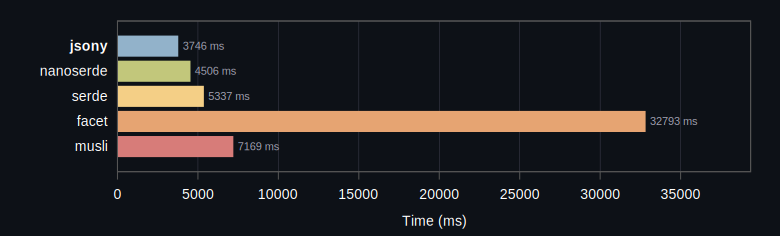


```rust
      jsony:  3746.01 ms   17.838644 Bcycles  46.817865 Binst  3745.06 task-clock      605 kb (stripped)
  nanoserde:  4506.36 ms   21.298460 Bcycles  58.927343 Binst  4504.72 task-clock      717 kb (stripped)
      serde:  5337.46 ms   25.155911 Bcycles  56.170123 Binst  5319.51 task-clock     1089 kb (stripped)
      facet: 32793.16 ms  157.701867 Bcycles 250.198675 Binst 32767.00 task-clock     5273 kb (stripped)
      musli:  7169.70 ms   34.089204 Bcycles  68.730374 Binst  7151.01 task-clock     1057 kb (stripped)
```

## Binary Size

### Binary Size (Release)


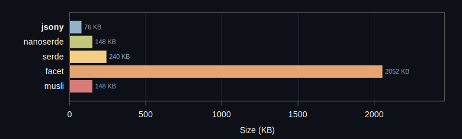


```rust
      jsony: 76 KB (stripped)
  nanoserde: 148 KB (stripped)
      serde: 240 KB (stripped)
      facet: 2052 KB (stripped)
      musli: 148 KB (stripped)
```

Baseline binary size: `376 KB (stripped)`
### Binary Size (Release LTO)


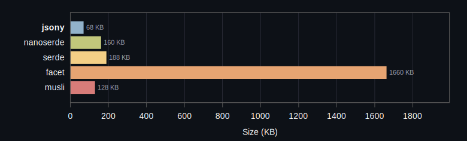


```rust
      jsony: 68 KB (stripped)
  nanoserde: 160 KB (stripped)
      serde: 188 KB (stripped)
      facet: 1660 KB (stripped)
      musli: 128 KB (stripped)
```

Baseline binary size: `340 KB (stripped)`
### Crate Versions
- **jsony**: itoa 1.0.17, jsony 0.1.9, jsony_macros 0.1.8, zmij 1.0.21
- **nanoserde**: nanoserde 0.2.1, nanoserde-derive 0.2.1
- **serde**: itoa 1.0.17, memchr 2.8.0, proc-macro2 1.0.106, quote 1.0.45, serde 1.0.228, serde_core 1.0.228, serde_derive 1.0.228, serde_json 1.0.149, syn 2.0.117, unicode-ident 1.0.24, zmij 1.0.21
- **facet**: aho-corasick 1.1.4, allocator-api2 0.2.21, autocfg 1.5.0, const-fnv1a-hash 1.1.0, equivalent 1.0.2, facet 0.44.1, facet-core 0.44.1, facet-dessert 0.44.1, facet-format 0.44.1, facet-json 0.44.1, facet-macro-parse 0.44.1, facet-macro-types 0.44.1, facet-macros 0.44.1, facet-macros-impl 0.44.1, facet-path 0.44.1, facet-reflect 0.44.1, facet-solver 0.44.1, foldhash 0.2.0, hashbrown 0.16.1, iddqd 0.3.17, impls 1.0.3, memchr 2.8.0, mutants 0.0.3, proc-macro2 1.0.106, quote 1.0.45, regex 1.12.3, regex-automata 0.4.14, regex-syntax 0.8.10, rustc-hash 2.1.1, smallvec 2.0.0-alpha.12, strsim 0.11.1, unicode-ident 1.0.24, unsynn 0.3.0
- **musli**: aho-corasick 1.1.4, cc 1.2.56, cfg-if 1.0.4, find-msvc-tools 0.1.9, generator 0.8.8, itoa 1.0.17, lazy_static 1.5.0, libc 0.2.183, log 0.4.29, loom 0.7.2, matchers 0.2.0, memchr 2.8.0, musli 0.0.149, musli-core 0.1.4, musli-macros 0.1.4, nu-ansi-term 0.50.3, once_cell 1.21.3, pin-project-lite 0.2.17, proc-macro2 1.0.106, quote 1.0.45, regex-automata 0.4.14, regex-syntax 0.8.10, rustversion 1.0.22, ryu 1.0.23, scoped-tls 1.0.1, serde 1.0.228, serde_core 1.0.228, serde_derive 1.0.228, sharded-slab 0.1.7, shlex 1.3.0, simdutf8 0.1.5, smallvec 1.15.1, syn 2.0.117, thread_local 1.1.9, tracing 0.1.44, tracing-core 0.1.36, tracing-log 0.2.0, tracing-subscriber 0.3.22, unicode-ident 1.0.24, valuable 0.1.1, windows-link 0.2.1, windows-result 0.4.1, windows-sys 0.61.2

