# Social Model with JSON + Binary

Same social media data model but testing both JSON and binary serialization & deserialization.

Data model: [social-with-binary_model.rs](social-with-binary_model.rs)

## Benchmark Results

### Libraries
- jsony v0.1.9
- nanoserde v0.2.1
- serde v1.0.228
- musli v0.0.149

### Incremental Modes
- `Disabled`: `-C incremental` wasn't specified in the rustc invocation
- `Unchanged`: Rebuild when no file content changed (`touch src/main.rs`)
- `Postfix`: New content added to end of the module
- `Prefix`: New content added to start of the module

### Metrics
Measured with Linux `perf stat`:
- **Duration**: Wall-clock time in milliseconds
- **Bcycles**: Billion CPU cycles
- **Binst**: Billion CPU instructions
- **task-clock**: CPU clock time across all cores

## Table of Contents

- [Warm Check](#warm-check): All dependencies cached and prebuilt, only the bin crate is checked. Rustc is invoked directly using the same parameters as cargo.
- [Warm Build](#warm-build): All dependencies cached and prebuilt, only the bin crate is rebuilt. Rustc is invoked directly using the same parameters as cargo.
- [Clean Build](#clean-build): Dependencies in global cache but target is empty after `cargo clean`. Measures full `cargo build` time.
- [Runtime Benchmark](#runtime-benchmark): Run the built executable with JSON input and high iteration count.
- [Binary Size](#binary-size): Stripped binary size of the built executable.

## Warm Check

### WarmCheck { incremental: Disabled }


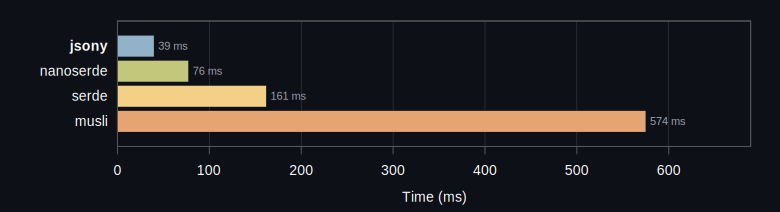


```rust
      jsony:    39.08 ms    0.155323 Bcycles   0.214489 Binst    36.39 task-clock
  nanoserde:    76.53 ms    0.330569 Bcycles   0.575836 Binst    71.85 task-clock
      serde:   161.27 ms    0.707488 Bcycles   1.045118 Binst   156.99 task-clock
      musli:   574.29 ms    2.695759 Bcycles   4.283944 Binst   572.21 task-clock
```

Baseline reference stats: `   38.03 ms    0.141993 Bcycles   0.207092 Binst    36.84 task-clock`
### WarmCheck { incremental: Unchanged }


```rust
      jsony:    20.89 ms    0.090077 Bcycles   0.139663 Binst    21.01 task-clock
  nanoserde:    29.67 ms    0.133867 Bcycles   0.244978 Binst    29.66 task-clock
      serde:    78.05 ms    0.328600 Bcycles   0.529090 Binst    73.61 task-clock
      musli:   228.13 ms    1.016227 Bcycles   1.689531 Binst   225.51 task-clock
```

Baseline reference stats: `   27.91 ms    0.090088 Bcycles   0.143364 Binst    26.72 task-clock`
### WarmCheck { incremental: Postfix }


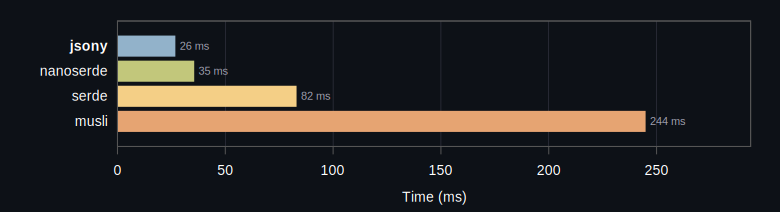


```rust
      jsony:    26.61 ms    0.093790 Bcycles   0.155969 Binst    23.20 task-clock
  nanoserde:    35.35 ms    0.149917 Bcycles   0.270553 Binst    35.07 task-clock
      serde:    82.81 ms    0.355598 Bcycles   0.576749 Binst    80.08 task-clock
      musli:   244.68 ms    1.099373 Bcycles   1.891646 Binst   239.51 task-clock
```

Baseline reference stats: `   27.42 ms    0.094292 Bcycles   0.153781 Binst    26.40 task-clock`
### WarmCheck { incremental: Prefix }


```rust
      jsony:    43.68 ms    0.209082 Bcycles   0.296351 Binst    45.22 task-clock
  nanoserde:    85.42 ms    0.391179 Bcycles   0.695981 Binst    82.73 task-clock
      serde:   195.47 ms    0.884453 Bcycles   1.285277 Binst   195.22 task-clock
      musli:   673.46 ms    3.171493 Bcycles   5.052724 Binst   670.88 task-clock
```

Baseline reference stats: `   47.98 ms    0.166987 Bcycles   0.233219 Binst    45.06 task-clock`
### WarmCheck { incremental: TypeTransform }


```rust
      jsony:    26.81 ms    0.126102 Bcycles   0.209361 Binst    26.72 task-clock
  nanoserde:    52.98 ms    0.238979 Bcycles   0.446434 Binst    50.69 task-clock
      serde:   111.71 ms    0.493345 Bcycles   0.791529 Binst   108.32 task-clock
      musli:   417.85 ms    1.956331 Bcycles   3.260185 Binst   415.88 task-clock
```

Baseline reference stats: `   42.87 ms    0.152302 Bcycles   0.214124 Binst    41.61 task-clock`
## Warm Build

### WarmBuild { incremental: Disabled, profile: Release }


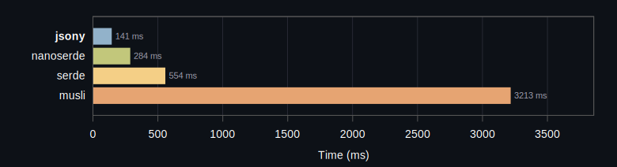


```rust
      jsony:   141.70 ms    2.145732 Bcycles   2.958645 Binst   480.29 task-clock
  nanoserde:   284.35 ms    3.088109 Bcycles   4.983061 Binst   680.78 task-clock
      serde:   554.58 ms    7.415371 Bcycles  10.414303 Binst  1648.47 task-clock
      musli:  3213.97 ms   17.660997 Bcycles  29.498554 Binst  3759.85 task-clock
```

Baseline reference stats: `  185.94 ms    1.028919 Bcycles   1.506728 Binst   245.78 task-clock`
### WarmBuild { incremental: Disabled, profile: Debug }


```rust
      jsony:    54.76 ms    0.332255 Bcycles   0.515504 Binst    75.03 task-clock
  nanoserde:   111.56 ms    0.713456 Bcycles   1.265007 Binst   161.03 task-clock
      serde:   304.37 ms    2.163028 Bcycles   3.453739 Binst   490.73 task-clock
      musli:   887.68 ms    5.610664 Bcycles   9.234501 Binst  1232.41 task-clock
```

Baseline reference stats: `  146.06 ms    0.719729 Bcycles   1.124864 Binst   185.59 task-clock`
### WarmBuild { incremental: Unchanged, profile: Debug }


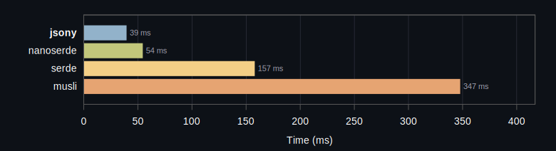


```rust
      jsony:    39.23 ms    0.172350 Bcycles   0.284777 Binst    41.86 task-clock
  nanoserde:    54.21 ms    0.258293 Bcycles   0.468593 Binst    61.56 task-clock
      serde:   157.65 ms    0.819450 Bcycles   1.344655 Binst   198.16 task-clock
      musli:   347.46 ms    1.886478 Bcycles   3.152007 Binst   440.16 task-clock
```

Baseline reference stats: `  101.91 ms    0.417065 Bcycles   0.704731 Binst   126.21 task-clock`
### WarmBuild { incremental: Postfix, profile: Debug }


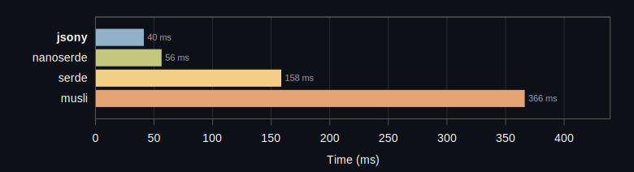


```rust
      jsony:    40.92 ms    0.169469 Bcycles   0.301508 Binst    40.24 task-clock
  nanoserde:    56.06 ms    0.260068 Bcycles   0.494419 Binst    59.92 task-clock
      serde:   158.22 ms    0.824299 Bcycles   1.392495 Binst   195.51 task-clock
      musli:   366.04 ms    1.968627 Bcycles   3.357223 Binst   458.77 task-clock
```

Baseline reference stats: `  105.05 ms    0.429284 Bcycles   0.715085 Binst   129.51 task-clock`
### WarmBuild { incremental: Prefix, profile: Debug }


```rust
      jsony:    73.98 ms    0.356902 Bcycles   0.528007 Binst    82.81 task-clock
  nanoserde:   135.05 ms    0.672900 Bcycles   1.220085 Binst   149.46 task-clock
      serde:   353.53 ms    2.017229 Bcycles   3.130292 Binst   461.40 task-clock
      musli:  1026.02 ms    5.528812 Bcycles   9.017919 Binst  1222.77 task-clock
```

Baseline reference stats: `  126.45 ms    0.511482 Bcycles   0.805083 Binst   148.40 task-clock`
### WarmBuild { incremental: TypeTransform, profile: Debug }


```rust
      jsony:    63.67 ms    0.345956 Bcycles   0.545068 Binst    78.34 task-clock
  nanoserde:    98.41 ms    0.632391 Bcycles   1.124916 Binst   143.49 task-clock
      serde:   280.86 ms    2.038519 Bcycles   3.270541 Binst   473.21 task-clock
      musli:   716.87 ms    4.742246 Bcycles   7.919067 Binst  1074.85 task-clock
```

Baseline reference stats: `  147.90 ms    0.783247 Bcycles   1.205162 Binst   215.84 task-clock`
## Clean Build

### CleanBuild { profile: Debug }


```rust
      jsony:   549.95 ms    4.651708 Bcycles   6.869910 Binst  1128.76 task-clock
  nanoserde:   642.73 ms    3.845533 Bcycles   6.102023 Binst   899.58 task-clock
      serde:  2417.48 ms   27.096832 Bcycles  39.582347 Binst  6458.91 task-clock
      musli:  4737.56 ms   28.018606 Bcycles  42.897756 Binst  6389.00 task-clock
```

Baseline reference stats: `  224.17 ms    1.146734 Bcycles   1.812710 Binst   318.14 task-clock`
### CleanBuild { profile: Release }


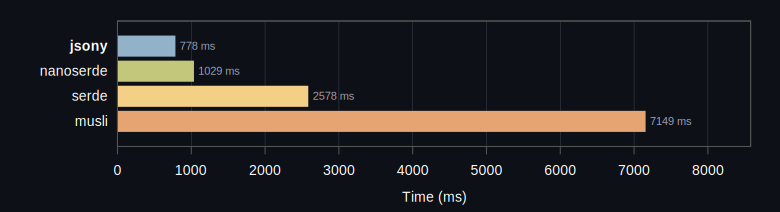


```rust
      jsony:   778.35 ms    9.085432 Bcycles  12.671487 Binst  2103.41 task-clock
  nanoserde:  1029.48 ms    9.743722 Bcycles  15.265772 Binst  2197.74 task-clock
      serde:  2578.47 ms   36.992642 Bcycles  52.424103 Binst  8647.80 task-clock
      musli:  7149.21 ms   40.579481 Bcycles  63.563132 Binst  8978.67 task-clock
```

Baseline reference stats: `  231.36 ms    1.157737 Bcycles   1.804378 Binst   288.28 task-clock`
## Runtime Benchmark

### RuntimeBenchmark { profile: ReleaseLto }


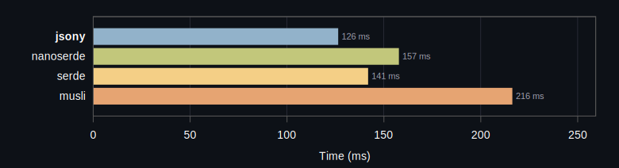


```rust
      jsony:   126.21 ms    0.486733 Bcycles   1.619886 Binst   116.13 task-clock       72 kb (stripped)
  nanoserde:   157.54 ms    0.589519 Bcycles   2.039384 Binst   139.35 task-clock      132 kb (stripped)
      serde:   141.64 ms    0.514884 Bcycles   1.709043 Binst   124.63 task-clock      160 kb (stripped)
      musli:   216.08 ms    0.911265 Bcycles   2.850208 Binst   204.26 task-clock      148 kb (stripped)
```

Baseline reference stats: `    0.00 ms    0.000000 Bcycles   0.000000 Binst     0.00 task-clock      341 kb (stripped)`
### RuntimeBenchmark { profile: Release }


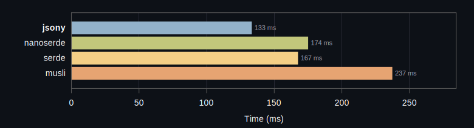


```rust
      jsony:   133.17 ms    0.562533 Bcycles   1.750448 Binst   132.82 task-clock       80 kb (stripped)
  nanoserde:   174.84 ms    0.706277 Bcycles   2.266027 Binst   164.81 task-clock      136 kb (stripped)
      serde:   167.33 ms    0.622684 Bcycles   2.009387 Binst   146.06 task-clock      196 kb (stripped)
      musli:   237.09 ms    0.990373 Bcycles   3.078041 Binst   220.53 task-clock      164 kb (stripped)
```

Baseline reference stats: `    0.00 ms    0.000000 Bcycles   0.000000 Binst     0.00 task-clock      377 kb (stripped)`
### RuntimeBenchmark { profile: Debug }


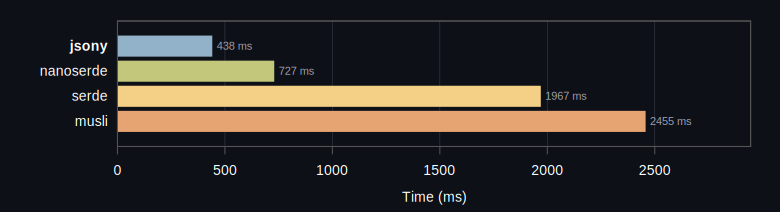


```rust
      jsony:   438.79 ms    2.011062 Bcycles   5.804260 Binst   438.36 task-clock      617 kb (stripped)
  nanoserde:   727.08 ms    3.405730 Bcycles   8.393549 Binst   726.66 task-clock      689 kb (stripped)
      serde:  1967.42 ms    9.221760 Bcycles  24.182871 Binst  1942.40 task-clock     1125 kb (stripped)
      musli:  2455.06 ms   11.457743 Bcycles  21.759742 Binst  2433.24 task-clock     1293 kb (stripped)
```

## Binary Size

### Binary Size (Release)


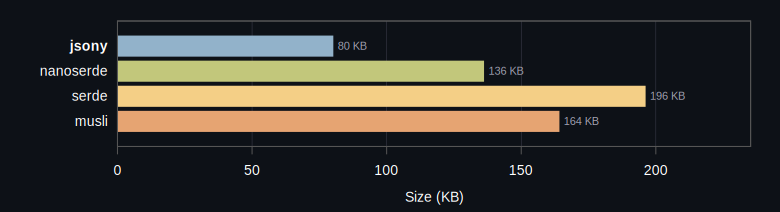


```rust
      jsony: 80 KB (stripped)
  nanoserde: 136 KB (stripped)
      serde: 196 KB (stripped)
      musli: 164 KB (stripped)
```

Baseline binary size: `376 KB (stripped)`
### Binary Size (Release LTO)


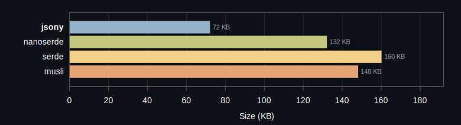


```rust
      jsony: 72 KB (stripped)
  nanoserde: 132 KB (stripped)
      serde: 160 KB (stripped)
      musli: 148 KB (stripped)
```

Baseline binary size: `340 KB (stripped)`
### Crate Versions
- **jsony**: itoa 1.0.17, jsony 0.1.9, jsony_macros 0.1.8, zmij 1.0.21
- **nanoserde**: nanoserde 0.2.1, nanoserde-derive 0.2.1
- **serde**: bincode 1.3.3, itoa 1.0.17, memchr 2.8.0, proc-macro2 1.0.106, quote 1.0.45, serde 1.0.228, serde_core 1.0.228, serde_derive 1.0.228, serde_json 1.0.149, syn 2.0.117, unicode-ident 1.0.24, zmij 1.0.21
- **musli**: aho-corasick 1.1.4, cc 1.2.56, cfg-if 1.0.4, find-msvc-tools 0.1.9, generator 0.8.8, itoa 1.0.17, lazy_static 1.5.0, libc 0.2.183, log 0.4.29, loom 0.7.2, matchers 0.2.0, memchr 2.8.0, musli 0.0.149, musli-core 0.1.4, musli-macros 0.1.4, nu-ansi-term 0.50.3, once_cell 1.21.3, pin-project-lite 0.2.17, proc-macro2 1.0.106, quote 1.0.45, regex-automata 0.4.14, regex-syntax 0.8.10, rustversion 1.0.22, ryu 1.0.23, scoped-tls 1.0.1, serde 1.0.228, serde_core 1.0.228, serde_derive 1.0.228, sharded-slab 0.1.7, shlex 1.3.0, simdutf8 0.1.5, smallvec 1.15.1, syn 2.0.117, thread_local 1.1.9, tracing 0.1.44, tracing-core 0.1.36, tracing-log 0.2.0, tracing-subscriber 0.3.22, unicode-ident 1.0.24, valuable 0.1.1, windows-link 0.2.1, windows-result 0.4.1, windows-sys 0.61.2

