# Synthetic Benchmark

Generates 75 random structs with random field types to test raw derive macro throughput and compilation overhead.

Data model: [synthetic_model.rs](synthetic_model.rs)

## Benchmark Results

### Libraries
- jsony v0.1.9
- nanoserde v0.2.1
- miniserde v0.1.45
- midiserde v0.1.1
- serde v1.0.228
- facet v0.44.1
- musli v0.0.149

### Incremental Modes
- `Disabled`: `-C incremental` wasn't specified in the rustc invocation
- `Unchanged`: Rebuild when no file content changed (`touch src/main.rs`)
- `Postfix`: New content added to end of the module
- `Prefix`: New content added to start of the module

### Metrics
Measured with Linux `perf stat`:
- **Duration**: Wall-clock time in milliseconds
- **Bcycles**: Billion CPU cycles
- **Binst**: Billion CPU instructions
- **task-clock**: CPU clock time across all cores

## Table of Contents

- [Warm Check](#warm-check): All dependencies cached and prebuilt, only the bin crate is checked. Rustc is invoked directly using the same parameters as cargo.
- [Warm Build](#warm-build): All dependencies cached and prebuilt, only the bin crate is rebuilt. Rustc is invoked directly using the same parameters as cargo.
- [Clean Build](#clean-build): Dependencies in global cache but target is empty after `cargo clean`. Measures full `cargo build` time.
- [Runtime Benchmark](#runtime-benchmark): Run the built executable with JSON input and high iteration count.
- [Binary Size](#binary-size): Stripped binary size of the built executable.

## Warm Check

### WarmCheck { incremental: Disabled }


```rust
      jsony:    89.77 ms    0.392170 Bcycles   0.618347 Binst    85.69 task-clock
  nanoserde:   244.91 ms    1.117755 Bcycles   2.120953 Binst   244.47 task-clock
  miniserde:   206.45 ms    0.942465 Bcycles   1.409771 Binst   203.04 task-clock
  midiserde:   320.02 ms    1.452841 Bcycles   2.068743 Binst   314.75 task-clock
      serde:   622.82 ms    2.877986 Bcycles   4.297366 Binst   619.39 task-clock
      facet:   473.95 ms    2.171776 Bcycles   3.171645 Binst   471.16 task-clock
      musli:  2453.80 ms   11.585360 Bcycles  18.257609 Binst  2449.20 task-clock
```

Baseline reference stats: `   19.97 ms    0.061297 Bcycles   0.104553 Binst    18.86 task-clock`
### WarmCheck { incremental: Unchanged }


```rust
      jsony:    50.34 ms    0.214053 Bcycles   0.383175 Binst    50.15 task-clock
  nanoserde:    94.15 ms    0.413318 Bcycles   0.820895 Binst    93.77 task-clock
  miniserde:   110.83 ms    0.475448 Bcycles   0.791042 Binst   109.04 task-clock
  midiserde:   177.49 ms    0.773246 Bcycles   1.232419 Binst   173.54 task-clock
      serde:   294.73 ms    1.302759 Bcycles   2.113009 Binst   292.80 task-clock
      facet:   299.19 ms    1.322342 Bcycles   2.122638 Binst   296.61 task-clock
      musli:   962.88 ms    4.442938 Bcycles   7.188798 Binst   958.70 task-clock
```

Baseline reference stats: `   15.33 ms    0.042796 Bcycles   0.074965 Binst    14.37 task-clock`
### WarmCheck { incremental: Postfix }


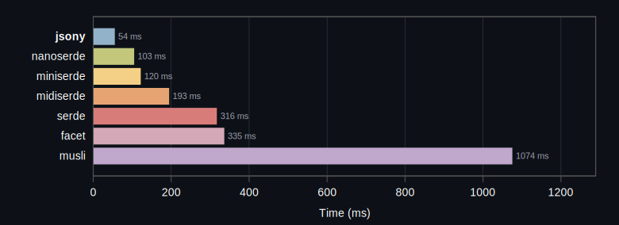


```rust
      jsony:    54.38 ms    0.240323 Bcycles   0.432419 Binst    54.23 task-clock
  nanoserde:   103.99 ms    0.439835 Bcycles   0.909311 Binst    99.57 task-clock
  miniserde:   120.88 ms    0.521825 Bcycles   0.872561 Binst   116.20 task-clock
  midiserde:   193.76 ms    0.839063 Bcycles   1.354982 Binst   191.72 task-clock
      serde:   316.14 ms    1.404330 Bcycles   2.315063 Binst   312.18 task-clock
      facet:   335.21 ms    1.477747 Bcycles   2.338223 Binst   333.34 task-clock
      musli:  1074.19 ms    5.005582 Bcycles   8.085724 Binst  1071.50 task-clock
```

Baseline reference stats: `   16.01 ms    0.045211 Bcycles   0.082433 Binst    15.02 task-clock`
### WarmCheck { incremental: Prefix }


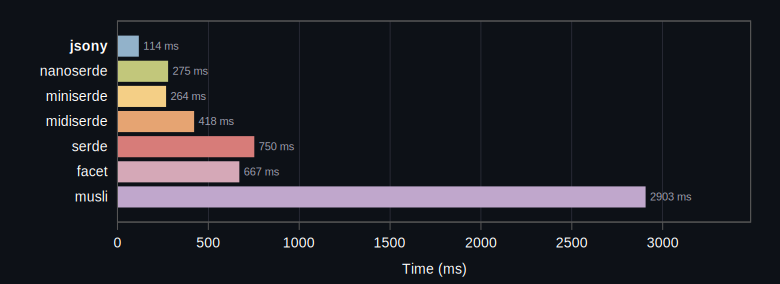


```rust
      jsony:   114.73 ms    0.536872 Bcycles   0.825975 Binst   116.95 task-clock
  nanoserde:   275.81 ms    1.284569 Bcycles   2.482635 Binst   277.94 task-clock
  miniserde:   264.71 ms    1.217498 Bcycles   1.790812 Binst   262.77 task-clock
  midiserde:   419.00 ms    1.927873 Bcycles   2.678942 Binst   417.94 task-clock
      serde:   750.12 ms    3.484732 Bcycles   5.205300 Binst   748.90 task-clock
      facet:   667.79 ms    3.066038 Bcycles   4.326801 Binst   665.47 task-clock
      musli:  2903.28 ms   13.727481 Bcycles  21.485005 Binst  2901.34 task-clock
```

Baseline reference stats: `   24.52 ms    0.069433 Bcycles   0.115768 Binst    21.06 task-clock`
### WarmCheck { incremental: TypeTransform }


```rust
      jsony:    90.76 ms    0.392131 Bcycles   0.617857 Binst    90.24 task-clock
  nanoserde:   229.54 ms    1.017605 Bcycles   1.963832 Binst   226.34 task-clock
  miniserde:   206.30 ms    0.922484 Bcycles   1.392175 Binst   204.03 task-clock
  midiserde:   298.32 ms    1.348290 Bcycles   1.974298 Binst   294.65 task-clock
      serde:   591.43 ms    2.707670 Bcycles   4.212410 Binst   586.43 task-clock
      facet:   471.10 ms    2.116694 Bcycles   3.196539 Binst   466.17 task-clock
      musli:  2253.59 ms   10.633073 Bcycles  17.129489 Binst  2251.10 task-clock
```

Baseline reference stats: `   23.96 ms    0.078459 Bcycles   0.142436 Binst    22.89 task-clock`
## Warm Build

### WarmBuild { incremental: Disabled, profile: Release }


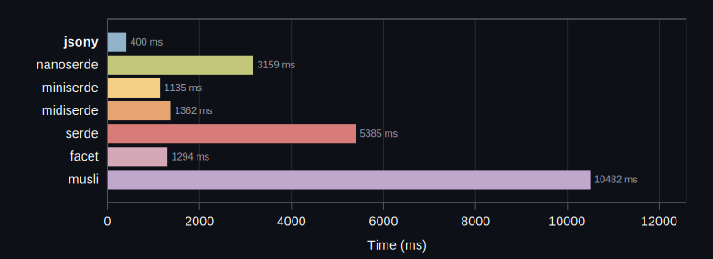


```rust
      jsony:   400.16 ms    2.359000 Bcycles   4.068241 Binst   514.24 task-clock
  nanoserde:  3159.56 ms   15.061986 Bcycles  30.939873 Binst  3164.50 task-clock
  miniserde:  1135.63 ms    6.493413 Bcycles  11.202888 Binst  1390.33 task-clock
  midiserde:  1362.10 ms    7.543619 Bcycles  12.640968 Binst  1620.32 task-clock
      serde:  5385.72 ms   29.922521 Bcycles  49.432201 Binst  6354.16 task-clock
      facet:  1294.99 ms   19.732387 Bcycles  30.586167 Binst  4446.39 task-clock
      musli: 10482.07 ms   51.450060 Bcycles  86.014068 Binst 10826.86 task-clock
```

Baseline reference stats: `  148.27 ms    0.572614 Bcycles   0.992724 Binst   142.63 task-clock`
### WarmBuild { incremental: Disabled, profile: Debug }


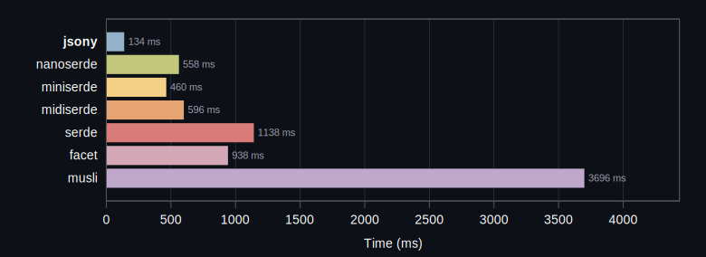


```rust
      jsony:   134.91 ms    0.812040 Bcycles   1.362708 Binst   187.04 task-clock
  nanoserde:   558.50 ms    2.740993 Bcycles   5.500466 Binst   597.94 task-clock
  miniserde:   460.39 ms    2.477907 Bcycles   4.037794 Binst   552.44 task-clock
  midiserde:   596.33 ms    3.147168 Bcycles   4.922053 Binst   701.85 task-clock
      serde:  1138.14 ms    6.650981 Bcycles  10.975517 Binst  1473.02 task-clock
      facet:   938.02 ms    5.864067 Bcycles   9.660011 Binst  1367.99 task-clock
      musli:  3696.18 ms   20.210110 Bcycles  33.484398 Binst  4374.64 task-clock
```

Baseline reference stats: `  119.91 ms    0.442604 Bcycles   0.811393 Binst   118.00 task-clock`
### WarmBuild { incremental: Unchanged, profile: Debug }


```rust
      jsony:    86.58 ms    0.392956 Bcycles   0.695224 Binst    95.27 task-clock
  nanoserde:   179.83 ms    0.841706 Bcycles   1.725305 Binst   195.20 task-clock
  miniserde:   198.72 ms    0.950413 Bcycles   1.624096 Binst   221.60 task-clock
  midiserde:   286.62 ms    1.319961 Bcycles   2.162412 Binst   309.41 task-clock
      serde:   462.66 ms    2.366004 Bcycles   4.014523 Binst   542.64 task-clock
      facet:   652.04 ms    3.035788 Bcycles   5.268377 Binst   747.07 task-clock
      musli:  1345.19 ms    6.790369 Bcycles  11.303067 Binst  1520.55 task-clock
```

Baseline reference stats: `   78.14 ms    0.288771 Bcycles   0.524465 Binst    88.89 task-clock`
### WarmBuild { incremental: Postfix, profile: Debug }


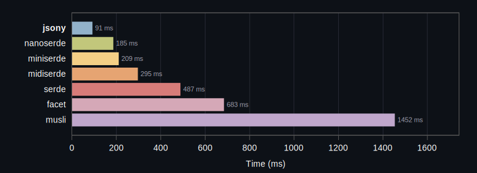


```rust
      jsony:    91.39 ms    0.412523 Bcycles   0.745366 Binst    99.69 task-clock
  nanoserde:   185.32 ms    0.879789 Bcycles   1.812783 Binst   199.34 task-clock
  miniserde:   209.66 ms    1.002777 Bcycles   1.705815 Binst   233.29 task-clock
  midiserde:   295.74 ms    1.391630 Bcycles   2.289194 Binst   322.01 task-clock
      serde:   487.29 ms    2.477196 Bcycles   4.220529 Binst   565.82 task-clock
      facet:   683.30 ms    3.198705 Bcycles   5.489867 Binst   783.04 task-clock
      musli:  1452.02 ms    7.333856 Bcycles  12.210296 Binst  1628.17 task-clock
```

Baseline reference stats: `   79.56 ms    0.292961 Bcycles   0.531659 Binst    90.35 task-clock`
### WarmBuild { incremental: Prefix, profile: Debug }


```rust
      jsony:   175.73 ms    0.826272 Bcycles   1.331894 Binst   185.56 task-clock
  nanoserde:   599.49 ms    2.838130 Bcycles   5.706078 Binst   619.21 task-clock
  miniserde:   538.47 ms    2.573416 Bcycles   4.021635 Binst   573.47 task-clock
  midiserde:   730.80 ms    3.610838 Bcycles   5.373975 Binst   803.06 task-clock
      serde:  1288.23 ms    7.229362 Bcycles  11.680339 Binst  1600.76 task-clock
      facet:  1097.41 ms    5.664669 Bcycles   8.863559 Binst  1330.18 task-clock
      musli:  4093.15 ms   21.051287 Bcycles  34.719543 Binst  4534.66 task-clock
```

Baseline reference stats: `  102.55 ms    0.398631 Bcycles   0.723011 Binst   115.62 task-clock`
### WarmBuild { incremental: TypeTransform, profile: Debug }


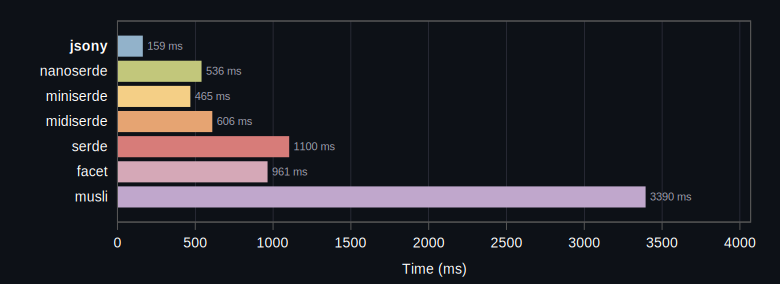


```rust
      jsony:   159.70 ms    0.926881 Bcycles   1.512701 Binst   215.47 task-clock
  nanoserde:   536.98 ms    2.776204 Bcycles   5.535368 Binst   612.86 task-clock
  miniserde:   465.20 ms    2.603165 Bcycles   4.214751 Binst   592.67 task-clock
  midiserde:   606.24 ms    3.281240 Bcycles   5.075010 Binst   744.39 task-clock
      serde:  1100.20 ms    6.756013 Bcycles  11.181818 Binst  1513.02 task-clock
      facet:   961.32 ms    5.898274 Bcycles   9.818339 Binst  1397.71 task-clock
      musli:  3390.76 ms   18.809844 Bcycles  31.507824 Binst  4117.39 task-clock
```

Baseline reference stats: `  109.77 ms    0.484316 Bcycles   0.871238 Binst   135.59 task-clock`
## Clean Build

### CleanBuild { profile: Debug }


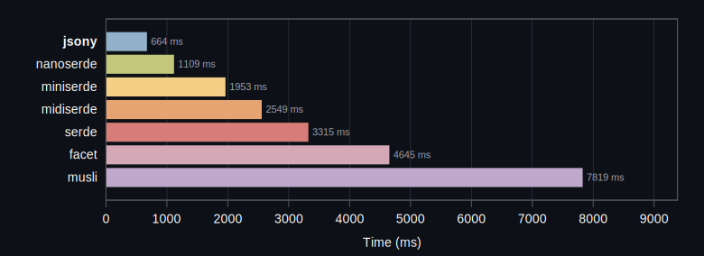


```rust
      jsony:   664.64 ms    5.305539 Bcycles   7.911985 Binst  1279.32 task-clock
  nanoserde:  1109.14 ms    6.132333 Bcycles  10.767114 Binst  1395.29 task-clock
  miniserde:  1953.31 ms   12.581621 Bcycles  19.144766 Binst  3038.23 task-clock
  midiserde:  2549.28 ms   18.223462 Bcycles  27.907231 Binst  4350.02 task-clock
      serde:  3315.14 ms   31.520881 Bcycles  47.064082 Binst  7413.54 task-clock
      facet:  4645.16 ms   65.915877 Bcycles  93.166425 Binst 15710.74 task-clock
      musli:  7819.44 ms   44.296845 Bcycles  70.107901 Binst  9881.05 task-clock
```

Baseline reference stats: `  162.31 ms    0.712246 Bcycles   1.288170 Binst   207.20 task-clock`
### CleanBuild { profile: Release }


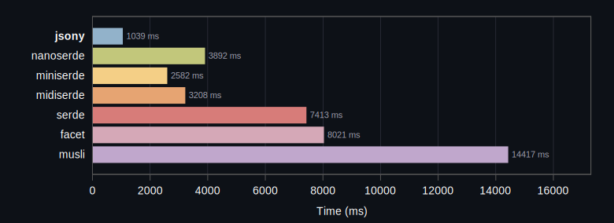


```rust
      jsony:  1039.09 ms    9.323827 Bcycles  13.780292 Binst  2150.39 task-clock
  nanoserde:  3892.92 ms   21.674476 Bcycles  41.221231 Binst  4663.94 task-clock
  miniserde:  2582.73 ms   17.710945 Bcycles  27.580183 Binst  4108.25 task-clock
  midiserde:  3208.15 ms   24.039553 Bcycles  37.403926 Binst  5577.07 task-clock
      serde:  7413.65 ms   58.869535 Bcycles  90.360059 Binst 13166.68 task-clock
      facet:  8021.42 ms  157.926233 Bcycles 218.746368 Binst 36843.18 task-clock
      musli: 14417.29 ms   74.313556 Bcycles 119.898972 Binst 16047.36 task-clock
```

Baseline reference stats: `  193.61 ms    0.712294 Bcycles   1.290059 Binst   189.38 task-clock`
## Runtime Benchmark

### RuntimeBenchmark { profile: ReleaseLto }


```rust
      jsony:   384.58 ms    1.769465 Bcycles   6.740030 Binst   371.64 task-clock      264 kb (stripped)
  nanoserde:   722.81 ms    3.369022 Bcycles  11.838366 Binst   702.79 task-clock      588 kb (stripped)
  miniserde:   729.56 ms    3.369149 Bcycles   8.638925 Binst   704.47 task-clock      292 kb (stripped)
  midiserde:   718.25 ms    3.303227 Bcycles   8.627624 Binst   692.25 task-clock      272 kb (stripped)
      serde:   436.97 ms    1.967833 Bcycles   6.808917 Binst   413.69 task-clock      852 kb (stripped)
      facet:  4557.81 ms   21.651990 Bcycles  48.885176 Binst  4534.03 task-clock     2056 kb (stripped)
      musli:   570.82 ms    2.609620 Bcycles   8.935220 Binst   548.11 task-clock      696 kb (stripped)
```

Baseline reference stats: `    0.00 ms    0.000000 Bcycles   0.000000 Binst     0.00 task-clock      325 kb (stripped)`
### RuntimeBenchmark { profile: Release }


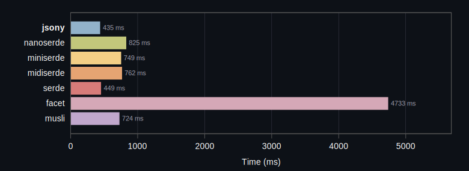


```rust
      jsony:   435.61 ms    1.996321 Bcycles   7.547944 Binst   420.25 task-clock      208 kb (stripped)
  nanoserde:   825.42 ms    3.890209 Bcycles  13.758279 Binst   817.26 task-clock      448 kb (stripped)
  miniserde:   749.21 ms    3.481984 Bcycles   8.854740 Binst   728.75 task-clock      304 kb (stripped)
  midiserde:   762.67 ms    3.556359 Bcycles   8.842041 Binst   744.96 task-clock      288 kb (stripped)
      serde:   449.10 ms    2.086607 Bcycles   7.357430 Binst   439.23 task-clock      832 kb (stripped)
      facet:  4733.87 ms   22.482398 Bcycles  51.893157 Binst  4715.91 task-clock     2736 kb (stripped)
      musli:   724.15 ms    3.418927 Bcycles  11.082132 Binst   713.36 task-clock      672 kb (stripped)
```

Baseline reference stats: `    0.00 ms    0.000000 Bcycles   0.000000 Binst     0.00 task-clock      365 kb (stripped)`
### RuntimeBenchmark { profile: Debug }


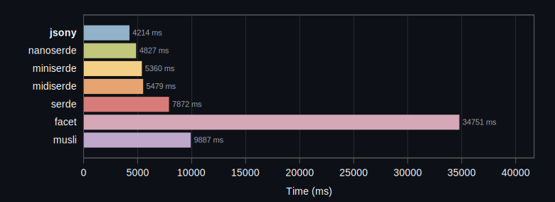


```rust
      jsony:  4214.75 ms   20.086133 Bcycles  52.411454 Binst  4213.86 task-clock      765 kb (stripped)
  nanoserde:  4827.35 ms   23.124903 Bcycles  64.059113 Binst  4826.36 task-clock     1261 kb (stripped)
  miniserde:  5360.06 ms   25.551060 Bcycles  59.426649 Binst  5358.35 task-clock     1073 kb (stripped)
  midiserde:  5479.90 ms   26.067013 Bcycles  59.941049 Binst  5470.11 task-clock     1101 kb (stripped)
      serde:  7872.05 ms   37.688666 Bcycles  88.210048 Binst  7845.86 task-clock     2029 kb (stripped)
      facet: 34751.84 ms  167.085304 Bcycles 252.450842 Binst 34732.60 task-clock     6337 kb (stripped)
      musli:  9887.21 ms   47.277586 Bcycles  94.739460 Binst  9875.31 task-clock     2989 kb (stripped)
```

## Binary Size

### Binary Size (Release)


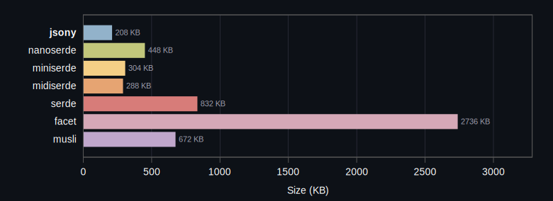


```rust
      jsony: 208 KB (stripped)
  nanoserde: 448 KB (stripped)
  miniserde: 304 KB (stripped)
  midiserde: 288 KB (stripped)
      serde: 832 KB (stripped)
      facet: 2736 KB (stripped)
      musli: 672 KB (stripped)
```

Baseline binary size: `364 KB (stripped)`
### Binary Size (Release LTO)


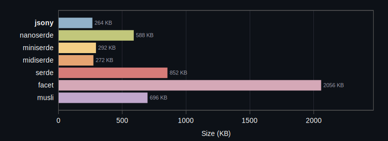


```rust
      jsony: 264 KB (stripped)
  nanoserde: 588 KB (stripped)
  miniserde: 292 KB (stripped)
  midiserde: 272 KB (stripped)
      serde: 852 KB (stripped)
      facet: 2056 KB (stripped)
      musli: 696 KB (stripped)
```

Baseline binary size: `324 KB (stripped)`
### Crate Versions
- **jsony**: itoa 1.0.17, jsony 0.1.9, jsony_macros 0.1.8, zmij 1.0.21
- **nanoserde**: nanoserde 0.2.1, nanoserde-derive 0.2.1
- **miniserde**: itoa 1.0.17, mini-internal 0.1.45, miniserde 0.1.45, proc-macro2 1.0.106, quote 1.0.45, syn 2.0.117, unicode-ident 1.0.24, zmij 1.0.21
- **midiserde**: itoa 1.0.17, midi-internal 0.1.1, midiserde 0.1.1, mini-internal 0.1.45, miniserde 0.1.45, proc-macro2 1.0.106, quote 1.0.45, syn 2.0.117, unicode-ident 1.0.24, zmij 1.0.21
- **serde**: itoa 1.0.17, memchr 2.8.0, proc-macro2 1.0.106, quote 1.0.45, serde 1.0.228, serde_core 1.0.228, serde_derive 1.0.228, serde_json 1.0.149, syn 2.0.117, unicode-ident 1.0.24, zmij 1.0.21
- **facet**: aho-corasick 1.1.4, allocator-api2 0.2.21, autocfg 1.5.0, const-fnv1a-hash 1.1.0, equivalent 1.0.2, facet 0.44.1, facet-core 0.44.1, facet-dessert 0.44.1, facet-format 0.44.1, facet-json 0.44.1, facet-macro-parse 0.44.1, facet-macro-types 0.44.1, facet-macros 0.44.1, facet-macros-impl 0.44.1, facet-path 0.44.1, facet-reflect 0.44.1, facet-solver 0.44.1, foldhash 0.2.0, hashbrown 0.16.1, iddqd 0.3.17, impls 1.0.3, memchr 2.8.0, mutants 0.0.3, proc-macro2 1.0.106, quote 1.0.45, regex 1.12.3, regex-automata 0.4.14, regex-syntax 0.8.10, rustc-hash 2.1.1, smallvec 2.0.0-alpha.12, strsim 0.11.1, unicode-ident 1.0.24, unsynn 0.3.0
- **musli**: aho-corasick 1.1.4, cc 1.2.56, cfg-if 1.0.4, find-msvc-tools 0.1.9, generator 0.8.8, itoa 1.0.17, lazy_static 1.5.0, libc 0.2.183, log 0.4.29, loom 0.7.2, matchers 0.2.0, memchr 2.8.0, musli 0.0.149, musli-core 0.1.4, musli-macros 0.1.4, nu-ansi-term 0.50.3, once_cell 1.21.3, pin-project-lite 0.2.17, proc-macro2 1.0.106, quote 1.0.45, regex-automata 0.4.14, regex-syntax 0.8.10, rustversion 1.0.22, ryu 1.0.23, scoped-tls 1.0.1, serde 1.0.228, serde_core 1.0.228, serde_derive 1.0.228, sharded-slab 0.1.7, shlex 1.3.0, simdutf8 0.1.5, smallvec 1.15.1, syn 2.0.117, thread_local 1.1.9, tracing 0.1.44, tracing-core 0.1.36, tracing-log 0.2.0, tracing-subscriber 0.3.22, unicode-ident 1.0.24, valuable 0.1.1, windows-link 0.2.1, windows-result 0.4.1, windows-sys 0.61.2

